<!--
 * @Author: lav1e2nrose 3341944494@qq.com
 * @Date: 2024-05-02 10:57:14
 * @LastEditors: lav1e2nrose 3341944494@qq.com
 * @LastEditTime: 2024-07-01 19:28:02
 * @FilePath: \chenjinglun_hw1\README.md
 * @Description: 这是默认设置,请设置`customMade`, 打开koroFileHeader查看配置 进行设置: https://github.com/OBKoro1/koro1FileHeader/wiki/%E9%85%8D%E7%BD%AE
-->
# algebra
硬件技术团队编程基础作业
[toc]
## 题目实现效果
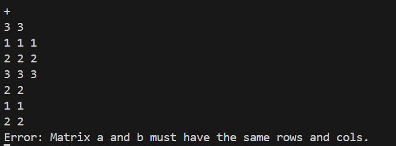
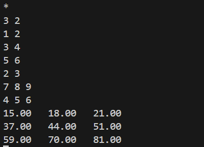
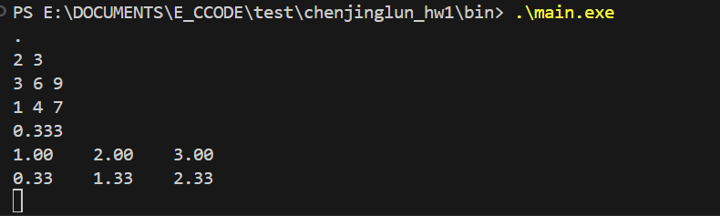 
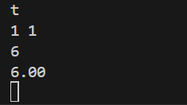
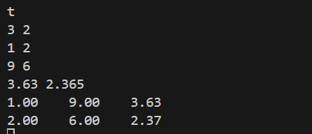 
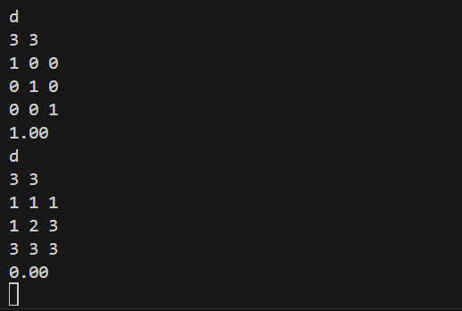 
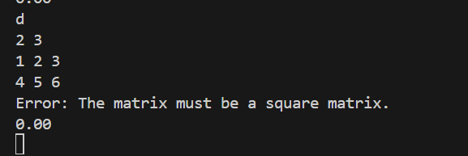 
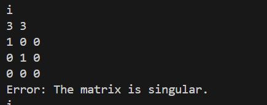 
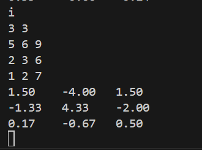 
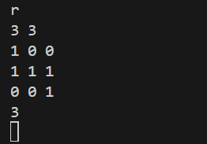
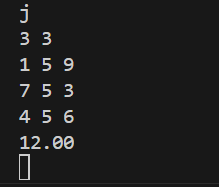
## 题目背景｜Background
《线性代数》作为浙江大学工科多数专业必修的数学基础课程，对于其掌握是至关重要的，后续各大专业的专业课程也都离不开线性代数。然而，在后续的专业课程学习中，我们往往只需要计算一些矩阵的数值解，这个过程如果用手去计算的话是十分痛苦的。秉承着“我都学编程了就不要自己做一些无意义的事情”的原则，我们决定实现一个线性代数计算库，来辅助我们进行运算。
> 当然，如MATLAB、Python等高级编程语言已经可以做到这类事情，且做得更好，但这并不妨碍我们通过这样一种方式来锻炼自己的C语言编程能力。
## 题目介绍｜Introduction
本仓库给出了我们在内训中提到的工程模板，同学们要做的任务如下：
1. 自学git，注册GitHub账号，将本仓库在自己的GitHub账户下Fork一份（注意是Fork，禁止直接clone本仓库到本地，否则你将无法完成后续提交），并按照`yourname_hw1`的格式更改仓库名称（在仓库中的Settings处可修改，记得不要用中文，仓库权限为public，如涉及到隐私保护，可设为private，但要将`tanninrachel@yinlin.wiki`这个账户设置为协作者）。
2. 将你的仓库clone到本地。
3. 按照内训所讲的工程模板补充所缺的文件夹。
4. 根据`inc/algebra.h`中的注释和预定义，在`src/algebra.c`中实现对应的函数。
5. 根据内训所讲，自行编写`CMakeLists.txt`文件，使你的工程能够在本地成功编译运行。
6. 自学Markdown，修改`README.md`文件，需要包含你的实现思路（大致描述即可）以及本地运行截图。
7. 将你的修改提交到远程仓库，并将仓库链接提交（提交方式待定）。
## 思路参考｜Thinking
见`doc`文件夹。
## 交互格式｜Format
在本题目中，`main.c`文件已给出，不需要同学们自己实现，也请不要更改这个文件，否则可能出现判题错误。
### 输入格式
本题目采用帧判定的思路进行，每一帧的第一行指令代码，`+`、`-`、`*`、`.`、`t`、`d`、`i`、`r`、`j`分别测试`add_matrix`、`sub_matrix`、`mul_matrix`、`scale_matrix`、`transpose_matrix`、`det_matrix`、`inv_matrix`、`rank_matrix`、`trace_matrix`函数，`q`表示退出。

接下来的一行输入矩阵 $\mathbf{A}$ 的行数 $m$ 和列数 $n$ ，在接下来的 $m$ 行中输入 $n$ 个双精度浮点数，以空格分开。
对于二元运算函数的测试，需要再按照上述过程输入矩阵 $\textbf{B}$ 。

可能的一次运行输入如下：
```
+
2 2
1.1 1.3
2.4 3.7
2 2
3.1 4.3
5.1 7.1
+
2 2
1.1 1.2
2.4 3.5
2 3
1 2 2.1
3 2 3.3
q
```
### 输出格式
在每一帧中，依次根据输入的指令代码运行对应的函数，并给出函数的输出与标准值比对。上述输入的正确输出如下：
```
4.20    5.60    
7.50    10.80
Error: Matrix a and b must have the same rows and cols.
```
## 评分标准｜Standard
* 成功运行：+25分
* `add_matrix`、`sub_matrix`、`mul_matrix`、`scale_matrix`、`transpose_matrix`、`trace_matrix`功能正常每个+5分
* `det_matrix`、`inv_matrix`、`rank_matrix`功能正常每个+15分
> 为了保证题目难度，每个函数具体的评分标准不予公布。

## 实现

### 求行列式
当矩阵为方阵时，一阶和二阶直接计算求值，高于二阶运用递归函数求解

### 求逆
当矩阵为方阵时，且矩阵的行列式的值不为0，可以求逆。当矩阵为一阶矩阵时，矩阵的逆的值为原行列式的值的倒数。当高于一阶时，可以运用递归求解。具体实现为找到该矩阵的伴随矩阵，根据矩阵求逆运算求解

### 求秩

求解矩阵的秩可以通过高斯消元法转化为上三角矩阵的过程来实现。对于 $m\times n$ 的矩阵 $\textbf{A}$ ，求 $\text{rank}(\textbf{A})$ 的具体步骤为：

1. 首先，函数初始化秩为矩阵行数和列数中较小的那个值：

$$
\text{rank} = \min(m,n)
$$

2. 接下来，函数将矩阵转化为上三角形式。这个过程通过高斯消元法实现，具体步骤如下：

   a. 对于每一列 $i$，从第 $i$ 行开始，检查当前主对角线上的元素 $a_{ii}$ 是否为零。如果 $a_{ii} \neq 0$ ，则表示可以进行高斯消元操作，否则需要在下方寻找一个非零元素，并将其与当前行交换。

   b. 对于当前主对角线上的元素 $a_{ii}$，将其下方的所有元素通过行运算消除为零，使得当前列下方的元素全部为零。

   c. 如果主对角线上的元素 $a_{ii}$ 为零，则需要在下方寻找一个非零元素 $a_{ji}$ 并将其与当前行交换，以确保在进行下一轮高斯消元时可以继续消去元素。

   d. 如果在下方找不到非零元素，说明当前列已经全为零，需要将秩减一，并将当前列的元素全部设为最后一列对应位置的元素。

3. 最后，函数返回计算得到的秩值。

其中，行运算的具体方式为

$$ R_j=R_j-\dfrac{a_{ji}}{a_{ii}}\times R_i $$

